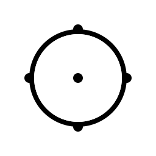

# Custom Mouse Cursor

## Posy Black
This is a slightly altered version of [Posy's Cursor Black](http://www.michieldb.nl/other/cursors)

# How to install
- Open the folder containing the cursors you want to install
- Right click the `_install .inf` file and click `Install`
- The cursors install automatically (You must agree to the installation) and will open "Mouse Properties" menu. You need press the "OK" button.

# How to build
Some of the cursors in this package have a `.svg` file associated with them. The `.png` and `.cur` files can be recreated from the SVG files. This allows you to update the cursors yourself.
- Edit an SVG file (optionally update the `hotspot` tag)
- Run `convert_all.bat` to convert all SVG files.