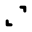
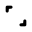
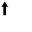

# Custom Mouse Cursor

## Posy Black
This is a slightly altered version of [Posy's Cursor Black](http://www.michieldb.nl/other/cursors)

# How to install
- Open the folder containing the cursors you want to install
- Right click the `_install .inf` file and click `Install`
- The cursors install automatically (You must agree to the installation) and will open "Mouse Properties" menu. You need to press the "OK" button.

# How to build
All cursors are created with `.svg` files. A python script converts those to their respective `.cur` or `.ani` file.
- Edit an SVG file.
- Run `convert_all.bat` to convert all SVG files.
- Optionally, you can run the script with an extra argument `--output-png` to keep the png files.

### Hotspot
With the custom attribute `hotspot="x y"` you can set the hotspot of the cursor. The XY coordinates are relative to the `viewBox`.

### Animation
Currently only `animateTransform` with a `linear` interpolation of `transform` is supported. With the custom attribute `frameCount` you can change the amount of frames of the animation.